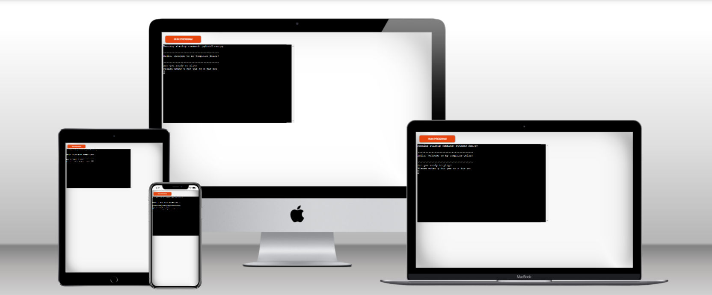
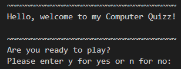
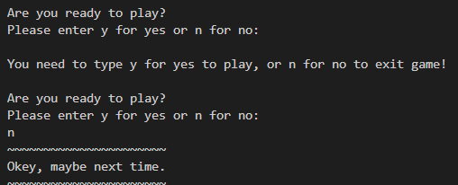
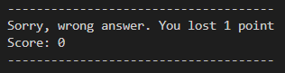
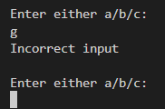
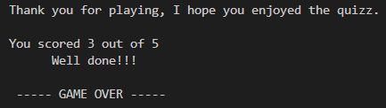
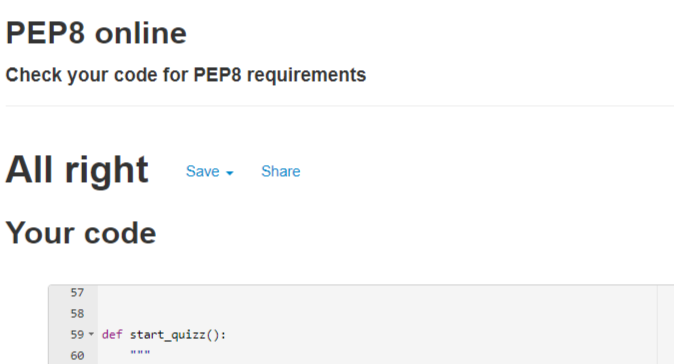

# **Python3 Computer Quizz**

The **Python3 Computer Quizz** is a Python terminal game that runs in Code Institutes mock terminal on Heroku.

Players are provided with questions associated to computers.

[You can find the live version of my project here!](https://python3-computer-quizz.herokuapp.com/)

 

# How to play
The **Python3 Computer Quizz** is based on the traditional quiz and uses an answer/option model where every answer has 3 options to chose from.
You can read about how quizzes came about and how the game works on
[Wikipedia.](https://en.wikipedia.org/wiki/Quiz)
 
 
# Features

## Existing Features

*  First the quiz wishes the player welcome and askes them if they are ready to play.

 
 
* If player choses to play, they are asked to enter their name.
If no name is entered the name 'Player' is used.

 
 

* If player choses not to play, they still need to enter n to exit game, if not the question   will be repeted until they do:

 
 
* The **Python3 Computer Quizz**, contains 5 questions with 3 options as answers to choose from, numbered as a) b) or c). When correct answer is entered, 1 point is added to the score and the game moves on to the next question.

 
 
* If incorrect answer is entered, 1 point is deducted from the score,

 - and if answer is not in the options given, the response is:

 
 

* When **Python3 Computer Quizz** is completed, the game thanks the player for participating and prints final score to the screen.

 
 

## Future Improvements
* Add more questions to be generated at random
* Add levels of difficulty for player to chose from
* Improved GUI
 
 
# Testing
The **Python3 Computer Quizz** -project has been manually tested by passing the code through:
* PEP8 validator result (shown below)

 

 
 

* During the process the code has been checked in the github terminal and issues have been dealt with when they've shown up.  
* The code has been tested multiple times in PEP8 and issues has been corrected
* Code has been manually tested in the terminal trough the whole process
 
 

## Language Used

* Python
 
 

## Bugs
 

### Solved Bugs
* I did have problems with NameError ,name 'score' undefined, because I'd missed passing score to the end_game() function wich resulted in final score = 0.
 

* I had difficulties deploying to Heroku. I found that the reason was that I was missing the package.json folder. I solved the problem by opening a new workspace in github and copied my code to it.
[This is the link to my faulty repository!](https://github.com/volausson/computer-quizz)

 
 

## Remaining Bugs
* No known bugs remaining
 
 

# Deploment

* This project was deployed using Code Instite's mock terminal for Heroku via the GitHub Terminal by using the git push heroku main code.
 
 

* The final code can be found on GitHub [__Here!__](https://github.com/volausson/python_3-computer-quizz)

 
 

# Credits & Content
* [Code Institute](https://learn.codeinstitute.net/) For deployement and tutorials
* [freepubquiz.co.uk](http://www.freepubquiz.co.uk/it-quiz-questions.html) For quiz questions
* Wikipedia, for history and details about the Quiz game 
* Spencer Barriball, My mentor

